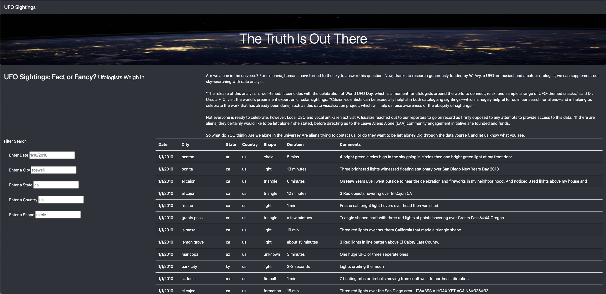
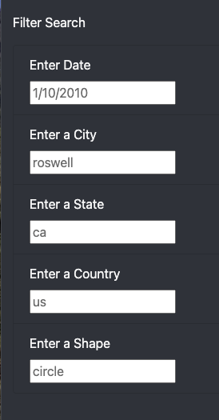
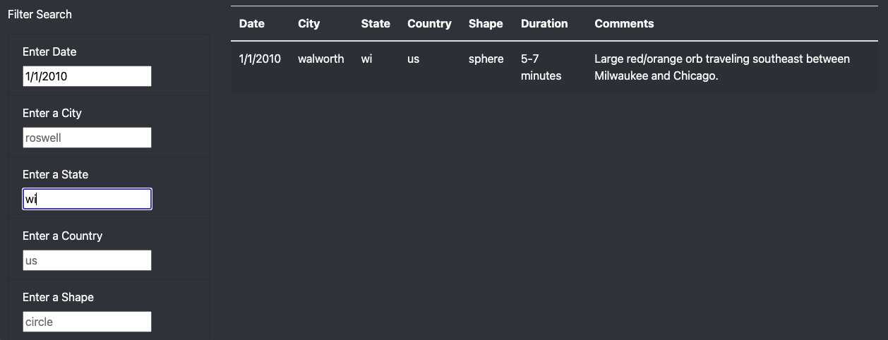

# UFO Analysis

## Overview of Project
The purpose of this analysis is to provide viewers of the webpage an in-depth analysis of UFO sightings by showing users a list of UFO sightings and allowing users to filter for multiple criteria at the same time. Filter criteria are date, city, state, country, and shape and the table on the page will automatically update based on the filter criteria.

## Results
This section describes how someone might use the webpage by walking them through the process of using the search criteria. I use images of the webpage during the filtering process to support my explanation.

The following image shows the initial layout of the entire webpage.

The webpage contains a title, a header, and text to describe the background and purpose of the website.  There is also a table with data from UFO sigtings and several input boxes that allow for filtering of the table. The inital data that is shown in the table when the user first loads the page are all UFO sightings.

There are several input boxes that allow the user to provide search criteria to filter the data in the table.  The following image shows the available filter criteria.

The input boxes show placeholder values as examples but these placeholder values have no impact on the selection and are not filtering the table.

The user can input any value into the input boxes to narrow down the rows that are displayed in the table. The table is filtered by the user provided value when the user The following image shows an example of a user selection where the user selected the data as **1/1/2010** and the state as **ca**.  The table is upddated to only show rows that meet this search criteria.

The table is updated every time a user enters a value into one of the available fields and hits enter, tab, or clicks into another input field.

## Summary
One drawback of this new design is that the data that is displayed on the website is stored in the file data.js and is therefore static and does not refresh to include newer UFO sightings. To update the data, the data.js file would need to be updated and deployed with the web page.

Another drawback of the current design is that the user can enter any value into the search input boxes. It is not obvious to the user what valid input values exist. 

Recommendations for further development are as follows:

1. Leverage a database to store the UFO sightings so new UFO sightings can easily be retrieved and included on the page without having to update the data.js file.

2. Limit the values that users can provide in the search input boxes to valid values in the table. This could be accomplished via drop down boxes with valid selections that exist in the table. 

3. Provide a way to include new UFO sightings. The web page will become stale and viewers will stop visiting the site if the data is not kept up to date. There could be a way for users to submit new UFO sightings directly on the website and store the new sightings in a database. Alternatively, there could be a way to scrape other websites for new UFO sightings and include these sightings on our web page by using Splinter and Beautiful Soup.